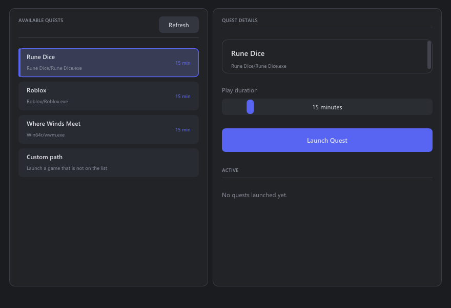

# Discord Quest Completer

> Automating Discord quests may break Discord's Terms of Service, use at your own risk.



Discord Quest Completer simulates "playing" a game so Discord marks its quest as
completed without you having to actually download and launch the game.

* **Always-current quest list**
  The available quests are fetched from the repo each time you open the app, so
  you never have to redownload anything when a new quest drops.
* **Custom games**
  You can add a custom game on your own if the list has not been updated.
* **Safe for games you own**
  If the real game is installed, your original files are restored automatically
  once the quest finishes.

## How to use

1. Download `DiscordQuestCompleter.exe` from the [Releases](../../releases) page.
2. Run it with administrator rights.
3. Pick a quest from the list on the left.
4. Set the play duration on the right.
5. Hit **Launch Quest**. A small progress window opens and Discord starts counting.
6. Let it finish, or press **Stop** to cancel early.

Steam games are located automatically. For anything else, choose **Custom path**
and enter the game's executable path.

## Building from source

Built with C++ and [Dear ImGui](https://github.com/ocornut/imgui).

```sh
git clone --recurse-submodules https://github.com/DownAP/discord-quest-completer
```

Open `discordquest.slnx` in Visual Studio 2026 and build (`x64` / `Release`).

